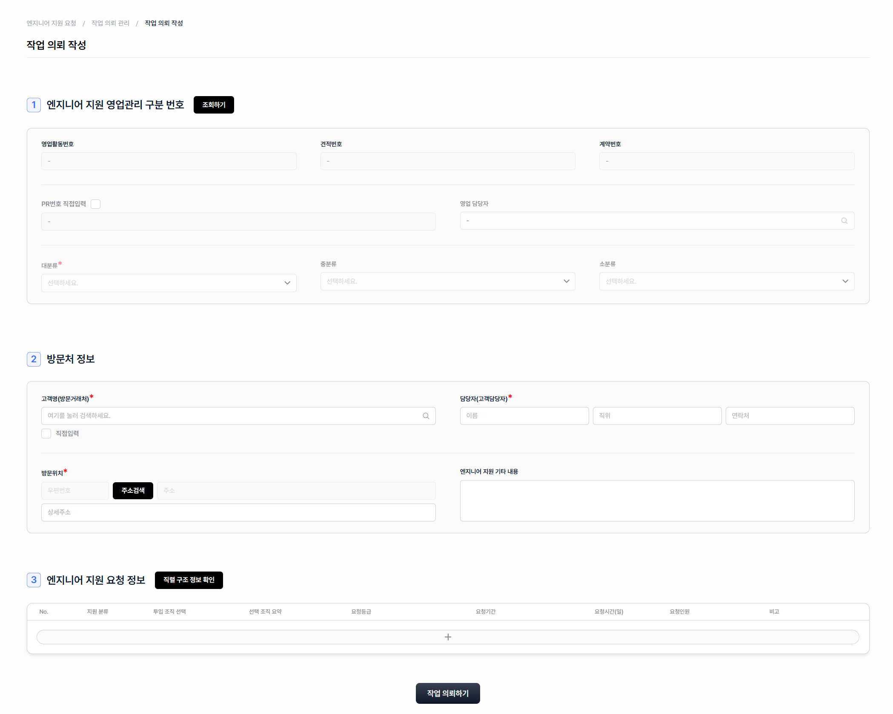
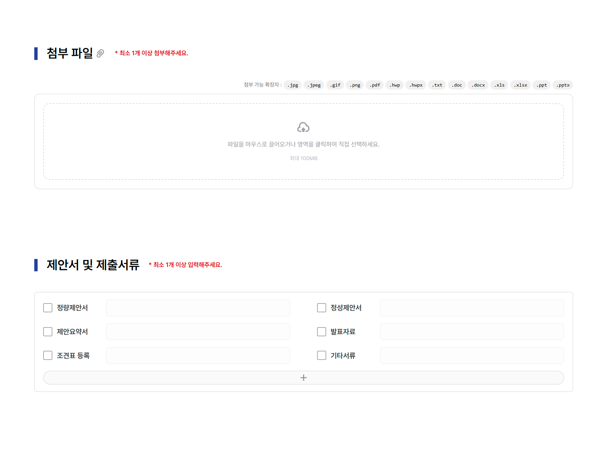
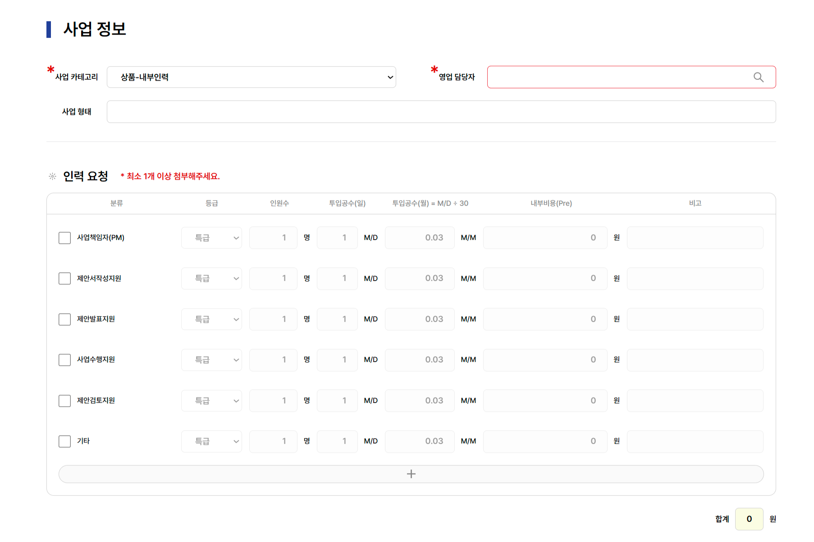
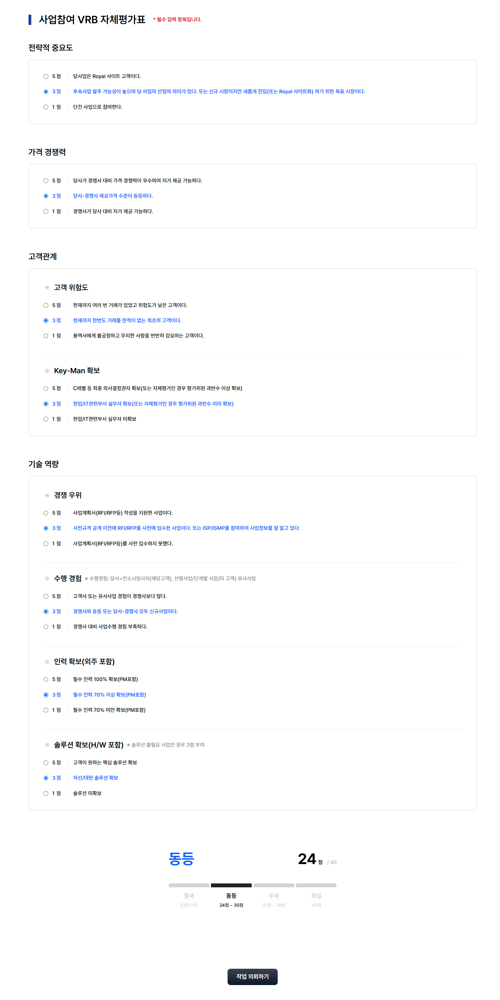

# 신규 작업 작성

<figure><figcaption></figcaption></figure>

**description: 모든 사원이 신규 작업을 작성할 수 있습니다.**

## **사업 공고 내용**

* 발주유형 : 공공, 민간, 기타 선택에 따라 필수 값이 달라집니다.
* 발주처, 수요 기관 : 등록된 거래처 이름으로 검색하여 선택합니다.
* 제안서(가격) 마감 일시 : Pre는 해당 일시 기준 이전 일자에만 배정이 가능합니다.

***

<figure><figcaption></figcaption></figure>

**첨부  파일, 제안서 및 제출서류**&#x20;

* 첨부 파일 : 가능한 확장자 jpg, jpeg, gif, png, pdf, hwp, hwpx, txt, dox, docx, xls, xlsx, ppt, pptx
* 제안서 및 제출서류 : 첨부 예정인 제안서 종류와 설명을 작성합니다.

***

<figure><figcaption></figcaption></figure>

## **사업 정보**&#x20;

* 사업 카테고리 : 선택한 사업에 따라 담당자가 달라집니다.
* 인력 요청: 분류, 등급, 인원수, 투입공수(MD)를 작성시 내부비용(Pre)가 계산됩니다.

***

<figure><figcaption></figcaption></figure>

## **참고 사항,  제안서 작성 지원(요청 사항)**

***

<figure><figcaption></figcaption></figure>

## **사업참여 VRB 자체평가표**

* 전략적 중요도, 가격 경쟁력, 고객관계, 기술 역량을 평가하여 확실, 우세, 동등, 열세 평가를 받습니다
