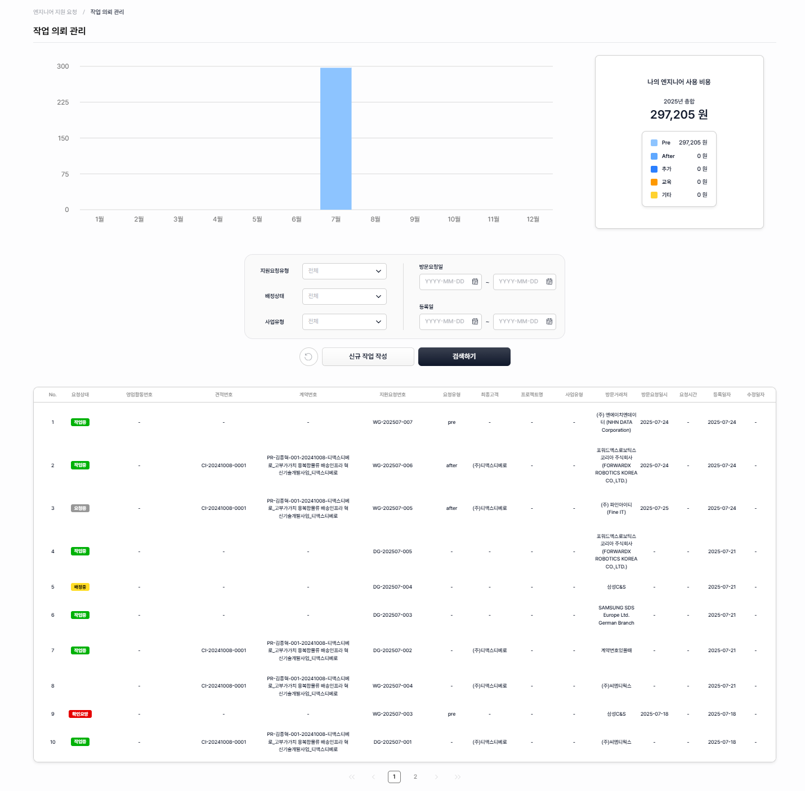

# 작업 의뢰 관리

<figure><figcaption></figcaption></figure>

### **작업 의뢰 리스트 항목**&#xD;

* 신규 작업 작성 : 지원 작업을 작성하는 화면으로 이동
* 리스트 : 항목을 선택하여 작성한 작업 상세 화면으로 이동

<figure><figcaption></figcaption></figure>

### **작업 의뢰 작성**

* 엔지니어 지원 영업관리 구분 번호 : 조회하여 등록된 영업활동번호, 견적, 계약 번호 세팅
* 방문처 정보 입력
* 엔지니어 지원 요청 정보 : 지원 분류, 투입조직, 직렬, 등급, 요청기간, 요청시간, 요청인원 입력하여 작업 의뢰
